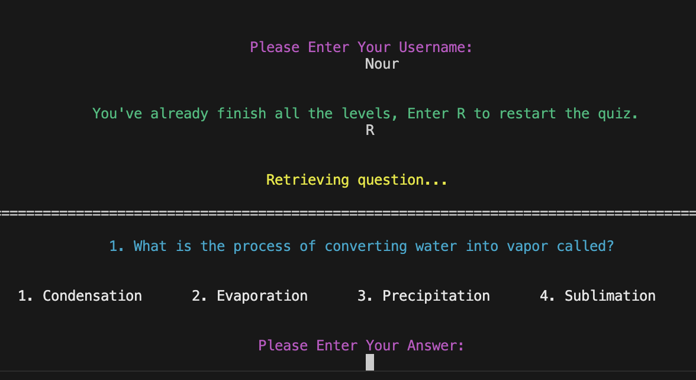

# [QUIZ](https://quiz-nour-426e9da53a01.herokuapp.com)

[](https://github.com/NourShbair/quiz/commits/main)
[](https://github.com/NourShbair/quiz/commits/main)
[](https://github.com/NourShbair/quiz)

The Text-Based Quiz Game is a Python application that tests your knowledge through a series of questions across various topics. The game features three difficulty levels—**Easy**, **Medium**, and **Hard**—and offers questions in three engaging categories: **Science**, **History**, and **Shows**.


## Features

### Existing Features

- **Three Difficulty Levels:**

    - Tackle questions at **Easy**, **Medium**, or **Hard** levels based on your preference.

        

- **Three Categories:**

    - A random question from **Science**, **History**, or **Shows** for a customized quiz experience.

    

- **Dynamic Scoring System:**

    - Earn full points for a correct answer on the **first try**.
	- Earn half points for a correct answer on the **second try**.
	- Get **0 points** if you fail twice.

        

- **Interactive Gameplay:**

    - Immediate feedback on your answers.

        

- **Progress Reset Option:**

    - If the user has already completed the quiz, they will be prompted to reset their progress by pressing “R” when they open the app again.
        
        


### Future Features
- Timed Questions 
    - Add a countdown timer for each question to make the game more challenging.
	- Award bonus points for faster answers.
- Lifelines/Hint System
    - Introduce lifelines like “50-50” (eliminate two incorrect options), “Skip Question,” or “Ask the Quizmaster” for hints.
- Personalized Quizzes
    - Use a small user survey to customize the quiz content based on their interests.

## Tools & Technologies Used
- [](https://tim.2bn.dev/markdown-builder) used to generate README and TESTING templates.
- [](https://git-scm.com) used for version control. (`git add`, `git commit`, `git push`)
- [](https://github.com) used for secure online code storage.
- [](https://code.visualstudio.com) used as my local IDE for development.
- [](https://en.wikipedia.org/wiki/HTML) used for change the start button text.
- [](https://en.wikipedia.org/wiki/CSS) used for update the layout of the template.
- [](https://www.python.org) used as the back-end programming language.
- [](https://www.heroku.com) used for hosting the deployed back-end site.
- [](https://docs.google.com/spreadsheets) used for storing data from my Python app.
- [](https://chat.openai.com) used to produce content and explain things.
- [](https://mermaid.live) Generate an interactive diagram for the data/schema.

## Data Model

I have used [Mermaid](https://mermaid.live) to generate some diagrams for my application.

- **Class Diagram**


- **Sequence Diagram**


- **Entity Relationship**


### Classes & Functions

The program uses classes as a blueprint for the project's objects (OOP). This allows for the object to be reusable.

```python
class Question(Printable):
    """
    This class for Question object, which extends Printable class,
    so, it can be printed "convert it to string"
    And it contains the question text, and the array of possible answers,
    and the correct answer
    """
    def __init__(self, text, answers, correct_answer, difficulty):
        self.text = text
        self.answers = []
        self.correct_answer = correct_answer
        self.difficulty = difficulty
        for answer in answers:
            """
            The Answer object has to vars, the answer text, 
            and a flag to
            determine if it is the correct answer
            """
            self.answers.append(Answer(answer, answer == correct_answer))
```

```python
class Answer(Printable):
    """
    This class for Answer object, which extends Printable 
    class, so, it can be printed "convert it to string"
    And it contains the answer text, and a flag to
    determine if it is the correct answer
    """

    def __init__(self, text, is_correct):
        self.text = text
        self._is_correct = is_correct
```

```python
class Sheet:
    """
    This class for google Sheet object,
    when passing the sheet name for the constructor,
    call the connect function:
    which has the suitable commands to access the sheet
    as well, this class contins a function to retrieve 
    all data from the appropriate worksheet
    """

    def __init__(self, name):
        self.name = name
        self.connect()
```

```python
class QuestionSheet(Sheet):
    """
    This class for QuestionSheet object which extends 
    Sheet class, so it is a subclass from superclass "Sheet"
    Its constructor contains level difficulty (easy, medium, 
    hard) and category (science, history, show)
    It contains a function for retrieving a random question 
    from the appropriate worksheet
    depending on its name (which is level_category)
    """

    def __init__(self, level, category):
        self.level = level
        self.category = category
        self.get_name()
        super().__init__(self.name)
```

```python
class UserDataSheet(Sheet):
    """
    This class for UserDataSheet object which extends Sheet
    class, so it is a subclass from superclass "Sheet"
    Its constructor contains username which supposed to be 
    unique to differentiate between users
    It contains a function for retrieving the user data from 
    User worksheet and also contains another function to 
    update the sheet with new records of the user
    """

    def __init__(self, username):
        self.username = username
        super().__init__("users")
```


The primary functions used on this application are:

- `show_introduction()`
    - Show the quiz instructions to the user before starting.
- `validate_username()`
    - Check if the username is not empty and contains at leat one letter.
- `get_question()`
    - Get a random question from a certain sheet.
- `validate_answer()`
    - Check if the answer is one from the possible answers (1,2,3 and 4).
- `continue_play()`
    - Get the answer from the user and go to next question if it is correct, and update User object with the new data.
- `start_play()`
    - Get the question depending on user data and pass these values to continue_play() function to continue the process.
- `restart_quiz()`
    -  Reset the quiz from the first question.
- `get_user_data()`
    -  This function for retrieving the user data from user worksheet and store it in User object
- `get_random_question()`
    -  This function for retrieving a random question from the appropriate worksheet depending on its name
- `update_user_sheet()`
    -  This function to update the sheet with new records of the user
- `create_user()`
    -  This function to create new user and update the sheet with new records of the user
- `main()`
    - Run all program functions.

### Imports

I've used the following Python packages and/or external imported packages.

- `gspread`: used with the Google Sheets API
- `google.oauth2.service_account`: used for the Google Sheets API credentials
- `os`: used for adding a `clear()` function
- `colorama`: used for including color in the terminal
- `random`: used to get a random choice from a list
- `shutil`: used to get terminal size

## Testing

> [!NOTE]  
> For all testing, please refer to the [TESTING.md](TESTING.md) file.

## Deployment

Code Institute has provided a [template](https://github.com/Code-Institute-Org/python-essentials-template) to display the terminal view of this backend application in a modern web browser.
This is to improve the accessibility of the project to others.

The live deployed application can be found deployed on [Heroku](https://quiz-nour-426e9da53a01.herokuapp.com).

### Heroku Deployment

This project uses [Heroku](https://www.heroku.com), a platform as a service (PaaS) that enables developers to build, run, and operate applications entirely in the cloud.

Deployment steps are as follows, after account setup:

- Select **New** in the top-right corner of your Heroku Dashboard, and select **Create new app** from the dropdown menu.
- Your app name must be unique, and then choose a region closest to you (EU or USA), and finally, select **Create App**.
- From the new app **Settings**, click **Reveal Config Vars**, and set the value of KEY to `PORT`, and the value to `8000` then select *add*.
- If using any confidential credentials, such as CREDS.JSON, then these should be pasted in the Config Variables as well.
- Further down, to support dependencies, select **Add Buildpack**.
- The order of the buildpacks is important, select `Python` first, then `Node.js` second. (if they are not in this order, you can drag them to rearrange them)

Heroku needs three additional files in order to deploy properly.

- requirements.txt
- Procfile
- runtime.txt

You can install this project's **requirements** (where applicable) using:

- `pip3 install -r requirements.txt`

If you have your own packages that have been installed, then the requirements file needs updated using:

- `pip3 freeze --local > requirements.txt`

The **Procfile** can be created with the following command:

- `echo web: node index.js > Procfile`

The **runtime.txt** file needs to know which Python version you're using:
1. type: `python3 --version` in the terminal.
2. in the **runtime.txt** file, add your Python version:
	- `python-3.9.19`

For Heroku deployment, follow these steps to connect your own GitHub repository to the newly created app:

Either:

- Select **Automatic Deployment** from the Heroku app.

Or:

- In the Terminal/CLI, connect to Heroku using this command: `heroku login -i`
- Set the remote for Heroku: `heroku git:remote -a app_name` (replace *app_name* with your app name)
- After performing the standard Git `add`, `commit`, and `push` to GitHub, you can now type:
	- `git push heroku main`

The frontend terminal should now be connected and deployed to Heroku!

### Local Deployment

This project can be cloned or forked in order to make a local copy on your own system.

For either method, you will need to install any applicable packages found within the *requirements.txt* file.

- `pip3 install -r requirements.txt`.

If using any confidential credentials, such as `CREDS.json` or `env.py` data, these will need to be manually added to your own newly created project as well.

#### Cloning

You can clone the repository by following these steps:

1. Go to the [GitHub repository](https://github.com/NourShbair/quiz) 
2. Locate the Code button above the list of files and click it 
3. Select if you prefer to clone using HTTPS, SSH, or GitHub CLI and click the copy button to copy the URL to your clipboard
4. Open Git Bash or Terminal
5. Change the current working directory to the one where you want the cloned directory
6. In your IDE Terminal, type the following command to clone my repository:
	- `git clone https://github.com/NourShbair/quiz.git`
7. Press Enter to create your local clone.

Alternatively, if using Gitpod, you can click below to create your own workspace using this repository.

[](https://gitpod.io/#https://github.com/NourShbair/quiz)

Please note that in order to directly open the project in Gitpod, you need to have the browser extension installed.
A tutorial on how to do that can be found [here](https://www.gitpod.io/docs/configure/user-settings/browser-extension).

#### Forking

By forking the GitHub Repository, we make a copy of the original repository on our GitHub account to view and/or make changes without affecting the original owner's repository.
You can fork this repository by using the following steps:

1. Log in to GitHub and locate the [GitHub Repository](https://github.com/NourShbair/quiz)
2. At the top of the Repository (not top of page) just above the "Settings" Button on the menu, locate the "Fork" Button.
3. Once clicked, you should now have a copy of the original repository in your own GitHub account!

## Credits

### Content

| Source | Location | Notes |
| --- | --- | --- |
| [Markdown Builder](https://tim.2bn.dev/markdown-builder) | README and TESTING | tool to help generate the Markdown files |
| [Pyhton](https://docs.python.org/2/library/string.html#string.center) | entire app  | Center the text in the screen |
| [FSymbols](https://fsymbols.com/generators/tarty/) | entire app | Fancy texting: |
| [datacamp](https://www.datacamp.com/tutorial/python-print-without-new-line?utm_source=google&utm_medium=paid_search&utm_campaignid=19589720824&utm_adgroupid=157156376311&utm_device=c&utm_keyword=&utm_matchtype=&utm_network=g&utm_adpostion=&utm_creative=720362650453&utm_targetid=dsa-2218886984100&utm_loc_interest_ms=&utm_loc_physical_ms=1007850&utm_content=&utm_campaign=230119_1-sea~dsa~tofu_2-b2c_3-row-p2_4-prc_5-na_6-na_7-le_8-pdsh-go_9-nb-e_10-na_11-na-bfcm24&gad_source=1&gbraid=0AAAAADQ9WsFDyqr-xflobs7f9YA67T2xR&gclid=Cj0KCQiAuou6BhDhARIsAIfgrn69RYwBbbQITvYm8B7mcPelLRgk8fbLlNFgYEC9RpisIe5q6irb5YYaApiZEALw_wcB%5C) | question answers | Print answers without new line |


### Acknowledgements

- I would like to thank my husband [Ahmad ElShareif](https://www.linkedin.com/in/ahmah2009/), for always believing in me, and encouraging me to make this 'transition' into web development.
- I would like to thank my Code Institute mentor, [Tim Nelson](https://github.com/TravelTimN) for his support throughout the development of this project.
- I would like to thank the [Code Institute](https://codeinstitute.net) tutor team for their assistance with troubleshooting and debugging some project issues.
- I would like to thank the [Code Institute Slack community](https://code-institute-room.slack.com) for the moral support; it kept me going during periods of self doubt and imposter syndrome.

