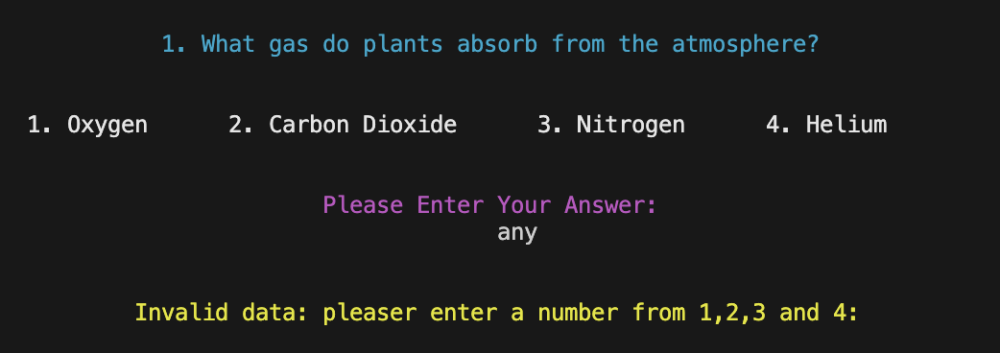
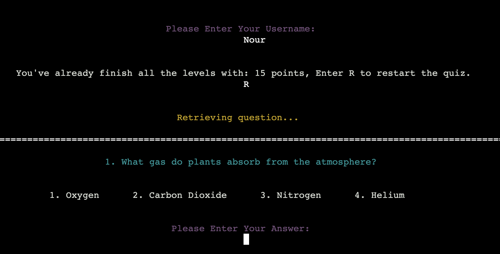
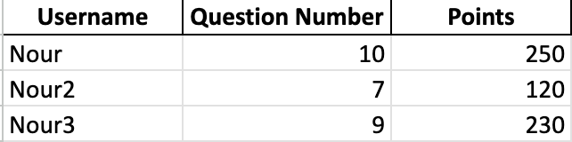

# Testing

> [!NOTE]  
> Return back to the [README.md](README.md) file.

## Code Validation
### Python

I have used the recommended [PEP8 CI Python Linter](https://pep8ci.herokuapp.com) to validate all of my Python files.

| Directory | File | CI URL | Screenshot | Notes |
| --- | --- | --- | --- | --- |
| quiz_app | game.py | [PEP8 CI](https://pep8ci.herokuapp.com/https://raw.githubusercontent.com/NourShbair/quiz/main/quiz_app/controller/game.py) |  | |
| quiz_app | question.py | [PEP8 CI](https://pep8ci.herokuapp.com/https://raw.githubusercontent.com/NourShbair/quiz/main/quiz_app/model/question.py) |  | |
| quiz_app | sheet.py | [PEP8 CI](https://pep8ci.herokuapp.com/https://raw.githubusercontent.com/NourShbair/quiz/main/quiz_app/model/sheet.py) |  | |
| quiz_app | user.py | [PEP8 CI](https://pep8ci.herokuapp.com/https://raw.githubusercontent.com/NourShbair/quiz/main/quiz_app/model/user.py) |  | |
| quiz_app | utils.py | [PEP8 CI](https://pep8ci.herokuapp.com/https://raw.githubusercontent.com/NourShbair/quiz/main/quiz_app/model/utils.py) |  | |
| quiz_app | constants.py | [PEP8 CI](https://pep8ci.herokuapp.com/https://raw.githubusercontent.com/NourShbair/quiz/main/quiz_app/view/constants.py) |  | |
| quiz_app | printer.py | [PEP8 CI](https://pep8ci.herokuapp.com/https://raw.githubusercontent.com/NourShbair/quiz/main/quiz_app/view/printer.py) |  | |
|  | run.py | [PEP8 CI](https://pep8ci.herokuapp.com/https://raw.githubusercontent.com/NourShbair/quiz/main/run.py) |  | |

## Browser Compatibility
I've tested my deployed project on multiple browsers to check for compatibility issues.

| Browser | Home | Notes |
| --- | --- | --- |
| Chrome |  | Works perfectly as expected |
| Firefox |  | Works perfectly as expected |
| Safari |  | Could not read input from user |

## Lighthouse Audit

I've tested my deployed project using the Lighthouse Audit tool to check for any major issues.

| Page | Mobile | Desktop | Notes |
| --- | --- | --- | --- |
| Home |  |  | Works as expected |

## Defensive Programming
Defensive programming was manually tested with the below user acceptance testing:

| Feature | Expectation | Test | Result | Fix | Screenshot |
| --- | --- | --- | --- | --- | --- |
| Input Validation | Ensures the user enters a valid option (1, 2, 3, or 4) for each question. | Provided invalid inputs (e.g., letters, special characters, numbers outside the range) to confirm that the app prompts users with a clear error message and re-requests valid input. |The feature behaved as expected | Test concluded and passed | 
| Graceful Handling of Unexpected Restarts | Handles cases where the user reopens the app after completing the quiz. | Verified that the app correctly identifies completed quizzes and displays a message to reset progress by pressing “R.” |The feature behaved as expected | Test concluded and passed | 
| Robust Question Navigation |  Ensures users can navigate through questions even if they input invalid answers multiple times. | Checked scenarios where the user fails twice on a question and validated that the app skips to the next question without breaking. |The feature behaved as expected | Test concluded and passed | -
| Score Calculation and Integrity | Ensures that scores are calculated accurately based on the number of correct answers and attempts per question. | Verified score accuracy across different scenarios, from perfect scores to skipped questions. |The feature behaved as expected | Test concluded and passed | 


## Bugs

- `Invalid username` when trying to enter empty space, or a name doesn't contain any letters

    

    - To fix this, I validate the username to be non-empty, and containing at least one character.
        ```python
        def validate_username(name):

            for char in name:
                if char.isalpha():
                    return True
            return False
        ```

- `ValueError:` invalid literal for int() with base 10: 'answer'

    

    - To fix this, I validate the answer to be exactly a number from 1 to 4.
        ```python
        def validate_answer(question, answer):
            """
            Inside the try, converts string value into int.
            Raises ValueError if strings cannot be converted into int,
            or if it is not one of 4 answers options (1,2,3,4).
            """
            possible_answers = [1, 2, 3, 4]
            ans = int(answer)
            if ans not in possible_answers:
                print("\n")
                colored_print(
                    "Invalid data: pleaser enter a number from 1,2,3 and 4:",
                    constants.YELLOW,
                    "center",
                )
                print("\n")
                ans = input(constants.CENTER_SPACE)
                return validate_answer(question, ans)
            else:
                entered_answer = question.answers[ans - 1]
                if entered_answer.is_correct():
                    print("\n")
                    colored_print(
                        "Great job! 🎉 That’s the correct answer! Keep it up!",
                        constants.GREEN,
                        "center",
                    )
                    return True
                else:
                    return False
        ```

- Python `E501 line too long` and `W291 trailing whitespace`

    

    - To fix this, I added 'noqa' for the long line
        ```python
        WELCOME_MSG = """ # noqa
        ```
    

## Unfixed Bugs

- The app may fail to read user input when running on the Safari browser.

    

