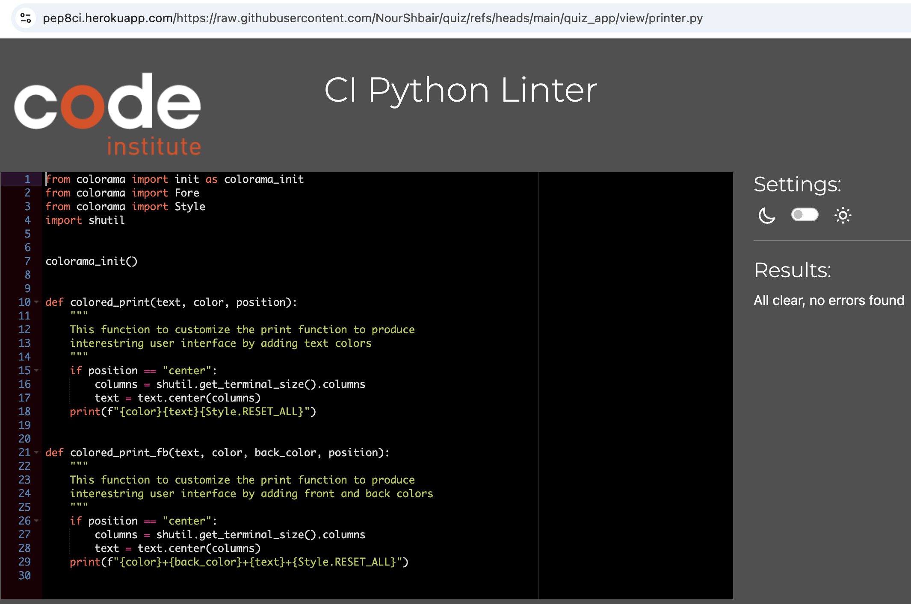

# Testing

> [!NOTE]  
> Return back to the [README.md](README.md) file.

## Code Validation
### Python

I have used the recommended [PEP8 CI Python Linter](https://pep8ci.herokuapp.com) to validate all of my Python files.

| Directory | File | CI URL | Screenshot | Notes |
| --- | --- | --- | --- | --- |
| quiz_app | game.py | [PEP8 CI](https://pep8ci.herokuapp.com/https://raw.githubusercontent.com/NourShbair/quiz/main/quiz_app/controller/game.py) |  | |
| quiz_app | question.py | [PEP8 CI](https://pep8ci.herokuapp.com/https://raw.githubusercontent.com/NourShbair/quiz/main/quiz_app/model/question.py) |  | |
| quiz_app | sheet.py | [PEP8 CI](https://pep8ci.herokuapp.com/https://raw.githubusercontent.com/NourShbair/quiz/main/quiz_app/model/sheet.py) |  | |
| quiz_app | user.py | [PEP8 CI](https://pep8ci.herokuapp.com/https://raw.githubusercontent.com/NourShbair/quiz/main/quiz_app/model/user.py) |  | |
| quiz_app | utils.py | [PEP8 CI](https://pep8ci.herokuapp.com/https://raw.githubusercontent.com/NourShbair/quiz/main/quiz_app/model/utils.py) |  | |
| quiz_app | constants.py | [PEP8 CI](https://pep8ci.herokuapp.com/https://raw.githubusercontent.com/NourShbair/quiz/main/quiz_app/view/constants.py) |  | |
| quiz_app | printer.py | [PEP8 CI](https://pep8ci.herokuapp.com/https://raw.githubusercontent.com/NourShbair/quiz/main/quiz_app/view/printer.py) |  | |
|  | run.py | [PEP8 CI](https://pep8ci.herokuapp.com/https://raw.githubusercontent.com/NourShbair/quiz/main/run.py) |  | |

## Browser Compatibility
I've tested my deployed project on multiple browsers to check for compatibility issues.

| Browser | Home | Notes |
| --- | --- | --- |
| Chrome |  | Works perfectly as expected |
| Firefox |  | Works perfectly as expected |
| Safari |  | Could not read input from user |

## Lighthouse Audit

I've tested my deployed project using the Lighthouse Audit tool to check for any major issues.

| Page | Mobile | Desktop | Notes |
| --- | --- | --- | --- |
| Home |  |  | Works as expected |

## Defensive Programming
Defensive programming was manually tested with the below user acceptance testing:

| Page | Expectation | Test | Result | Fix | Screenshot |
| --- | --- | --- | --- | --- | --- |
| Home | | | | | |
| | Feature is expected to do X when the user does Y | Tested the feature by doing Y | The feature behaved as expected, and it did Y | Test concluded and passed |  |
| | Feature is expected to do X when the user does Y | Tested the feature by doing Y | The feature did not respond to A, B, or C. | I did Z to the code because something was missing |  |
| About | | | | | |
| | Feature is expected to do X when the user does Y | Tested the feature by doing Y | The feature behaved as expected, and it did Y | Test concluded and passed |  |
| | Feature is expected to do X when the user does Y | Tested the feature by doing Y | The feature did not respond to A, B, or C. | I did Z to the code because something was missing |  |
| Gallery | | | | | |
| | Feature is expected to do X when the user does Y | Tested the feature by doing Y | The feature behaved as expected, and it did Y | Test concluded and passed |  |
| | Feature is expected to do X when the user does Y | Tested the feature by doing Y | The feature did not respond to A, B, or C. | I did Z to the code because something was missing |  |
| Contact | | | | | |
| | Feature is expected to do X when the user does Y | Tested the feature by doing Y | The feature behaved as expected, and it did Y | Test concluded and passed |  |
| | Feature is expected to do X when the user does Y | Tested the feature by doing Y | The feature did not respond to A, B, or C. | I did Z to the code because something was missing |  |
| repeat for all remaining pages | x | x | x | x | x |


## Bugs

- `Invalid username` when trying to enter empty space, or a name doesn't contain any letters

    

    - To fix this, I validate the username to be non-empty, and containing at least one character.
        ```python
        def validate_username(name):

            for char in name:
                if char.isalpha():
                    return True
            return False
        ```

- `ValueError:` invalid literal for int() with base 10: 'answer'

    

    - To fix this, I validate the answer to be exactly a number from 1 to 4.
        ```python
        def validate_answer(question, answer):
            """
            Inside the try, converts string value into int.
            Raises ValueError if strings cannot be converted into int,
            or if it is not one of 4 answers options (1,2,3,4).
            """
            possible_answers = [1, 2, 3, 4]
            ans = int(answer)
            if ans not in possible_answers:
                print("\n")
                colored_print(
                    "Invalid data: pleaser enter a number from 1,2,3 and 4:",
                    constants.YELLOW,
                    "center",
                )
                print("\n")
                ans = input(constants.CENTER_SPACE)
                return validate_answer(question, ans)
            else:
                entered_answer = question.answers[ans - 1]
                if entered_answer.is_correct():
                    print("\n")
                    colored_print(
                        "Great job! 🎉 That’s the correct answer! Keep it up!",
                        constants.GREEN,
                        "center",
                    )
                    return True
                else:
                    return False
        ```

- Python `E501 line too long` and `W291 trailing whitespace`

    

    - To fix this, I added 'noqa' for the long line
        ```python
        WELCOME_MSG = """ # noqa
        ```
    

## Unfixed Bugs

- For PP3, when using a helper `clear()` function, any text above the height of the terminal does not clear, and remains when you scroll up.

    

    - Attempted fix: I tried to adjust the terminal size, but it only resizes the actual terminal, not the allowable area for text.

- The app may fail to read user input when running on the Safari browser.

    

